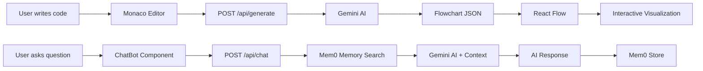

# AlgoFlow 🚀

<div align="center">


[](https://vercel.com)
[](https://render.com)

**Master algorithms visually with AI-powered flowcharts.**

*An intelligent coding companion that transforms your code into interactive flowcharts in real-time. Designed for students, developers, and visual learners—bridging the gap between abstract logic and clear understanding through the power of AI.*

[🚀 Live Demo](https://algo-flow-roan.vercel.app)

</div>

---

## 📋 Table of Contents

- [What is AlgoFlow?](#what-is-algoflow)
- [Key Features](#key-features)
- [Tech Stack](#tech-stack)
- [Project Structure](#project-structure)
- [Local Setup](#local-setup)
- [Deployment Guide](#deployment-guide)
- [How It Works](#how-it-works)
- [API Endpoints](#api-endpoints)
- [Contributing](#contributing)

---

## 🎯 What is AlgoFlow?

> **"Stop tracing loops in your head—see them on the screen."**

Writing code is easy; understanding complex logic is hard. AlgoFlow takes your Python or JavaScript code and uses **Google Gemini AI** to generate step-by-step visual representations of how your algorithm runs.

Whether you're debugging a recursive function or learning data structures, AlgoFlow provides instant visual feedback—plus an **AI tutor** that remembers your learning journey through intelligent memory systems powered by Mem0.

---

## ✨ Key Features

<table>
<tr>
<td width="50%">

### 🎨 Visual Intelligence
- **Instant Visualization** - Type code in Monaco Editor, see logic flow rendered with React Flow
- **Interactive Flowcharts** - Zoom, pan, and explore your algorithm's structure with XYFlow
- **Beautiful UI** - Animated landing page with GSAP and Framer Motion effects

</td>
<td width="50%">

### 🤖 AI-Powered Learning
- **Smart Analysis** - Google Gemini 2.5 Flash Lite understands complex logic and recursions
- **Complexity Insights** - Automatic Time (Big O) and Space complexity calculations
- **Intelligent Chatbot** - AI tutor powered by Mem0 remembers context across sessions

</td>
</tr>
<tr>
<td width="50%">

### 🔐 Security & Performance
- **Protected Routes** - Secure authentication with session management
- **Optimized Builds** - Vite for lightning-fast HMR and production bundles
- **Responsive Design** - Works seamlessly across desktop and mobile

</td>
<td width="50%">

### 🚀 Production Ready
- **Modern Stack** - React 19, Express 5, Node.js 18+
- **Cloud Deployed** - Vercel (Frontend) + Render (Backend)
- **RESTful API** - Well-documented endpoints with health monitoring

</td>
</tr>
</table>

---

## 🛠️ Tech Stack

### Frontend (`algo-client`)

| Technology | Purpose | Why We Use It |
|-----------|---------|---------------|
| **React 19** | UI Framework | Latest React with improved concurrent features for smooth rendering |
| **Vite** | Build Tool | Lightning-fast HMR, optimized builds, and modern ES module support |
| **React Router DOM** | Routing | Client-side routing for seamless navigation between landing page, login, and editor |
| **Monaco Editor** | Code Editor | VS Code's editor component for syntax highlighting and IntelliSense |
| **@xyflow/react (React Flow)** | Flowchart Rendering | Interactive node-based graphs for visualizing algorithm flow |
| **GSAP** | Animations | Professional-grade animations for landing page (scroll triggers, tweens) |
| **Framer Motion** | UI Animations | Declarative animations for interactive UI components |
| **Lucide React** | Icons | Beautiful, consistent icon library |

**Deployment:** Vercel (Frontend) - Optimized for React SPAs with automatic HTTPS and CDN

### Backend (`server`)

| Technology | Purpose | Why We Use It |
|-----------|---------|---------------|
| **Express.js** | Web Framework | Fast, minimalist Node.js framework for REST API endpoints |
| **@google/generative-ai** | AI Integration | Official Google SDK for Gemini API (flowchart generation & chat) |
| **Mem0 AI** | Memory Layer | Persistent AI memory system that remembers user conversations and learning patterns |
| **CORS** | Security | Enables secure cross-origin requests between frontend and backend |
| **dotenv** | Configuration | Environment variable management for API keys |

**Deployment:** Render (Backend) - Reliable Node.js hosting with automatic deployments

---

## 📁 Project Structure

```
AlgoFlow/
├── algo-client/                 # Frontend React application
│   ├── src/
│   │   ├── components/
│   │   │   ├── Editor/          # Monaco-based code editor with flowchart viewer
│   │   │   ├── ChatBot/         # AI chatbot with Mem0 memory
│   │   │   ├── FlowChartViewer/ # React Flow visualization
│   │   │   ├── Login/           # Authentication UI
│   │   │   ├── ProtectedRoute/  # Route guards
│   │   │   └── LP*/             # Landing page components (Nav, Hero, Features, etc.)
│   │   ├── pages/
│   │   │   ├── LandingPage/     # Marketing page with animations
│   │   │   └── LearnSpace/      # Main editor workspace
│   │   └── App.jsx              # Router configuration
│   ├── vite.config.js           # Vite build configuration
│   └── vercel.json              # Vercel deployment config
│
└── server/                      # Backend Express API
    ├── routes/
    │   ├── generate.js          # POST /api/generate - Flowchart generation
    │   └── chat.js              # POST /api/chat - AI tutor with memory
    ├── services/
    │   └── ai.js                # Gemini AI + Mem0 initialization
    ├── prompts/
    │   ├── flowchart.js         # System prompt for flowchart generation
    │   └── chat.js              # System prompt for AI tutor
    ├── config/
    │   └── index.js             # Environment configuration
    └── index.js                 # Express server entry point
```

---

## 🚀 Local Setup

### Prerequisites

Before you begin, ensure you have the following installed:

| Requirement | Version | Download Link |
|------------|---------|---------------|
| **Node.js** | 18.x or higher | [Download](https://nodejs.org/) |
| **npm** | Comes with Node.js | - |
| **Google Gemini API Key** | - | [Get API Key](https://aistudio.google.com/apikey) |
| **Mem0 API Key** | - | [Get API Key](https://app.mem0.ai/) |

---

### Step 1: Clone the Repository

```bash
git clone https://github.com/yourusername/AlgoFlow.git
cd AlgoFlow
```

### Step 2: Backend Setup

Navigate to the server directory and install dependencies:

```bash
cd server
npm install
```

Create a `.env` file in the `server/` directory:

```env
PORT=4000
GEMINI_API_KEY=your_gemini_api_key_here
MEM0_API_KEY=your_mem0_api_key_here
```

> **⚠️ Security Warning:** Never commit `.env` files to version control! Add `.env` to your `.gitignore`.

Start the backend server:

```bash
npm start
```

✅ Server will run on `http://localhost:4000`

---

### Step 3: Frontend Setup

Open a new terminal and navigate to the client directory:

```bash
cd algo-client
npm install
```

Create a `.env` file in the `algo-client/` directory (optional):

```env
VITE_API_URL=http://localhost:4000
```

Start the development server:

```bash
npm run dev
```

✅ Frontend will run on `http://localhost:5173`

---

### Step 4: Verify Setup

<div align="center">

| Step | Action | Expected Result |
|------|--------|----------------|
| 1️⃣ | Open `http://localhost:5173` | Landing page loads |
| 2️⃣ | Navigate to `/learn-space` | Code editor appears |
| 3️⃣ | Enter sample code | Monaco Editor syntax highlighting works |
| 4️⃣ | Click "Generate" | Flowchart renders on the right |
| 5️⃣ | Open AI Chat | Chatbot interface appears |

</div>

🎉 **You're all set!** Start coding and visualizing algorithms.

---

## 🌐 Deployment Guide

### Deploy Frontend to Vercel

<details>
<summary><b>Click to expand Vercel deployment steps</b></summary>

<br>

1. **Install Vercel CLI** (optional):
   ```bash
   npm i -g vercel
   ```

2. **Connect to Vercel:**
   - Push your code to GitHub
   - Go to [vercel.com](https://vercel.com)
   - Click "New Project"
   - Import your GitHub repository
   - Select `algo-client` as the root directory

3. **Configure Build Settings:**
   
   | Setting | Value |
   |---------|-------|
   | Framework Preset | `Vite` |
   | Build Command | `npm run build` |
   | Output Directory | `dist` |
   | Install Command | `npm install` |

4. **Set Environment Variables** (if needed):
   ```
   VITE_API_URL=https://your-backend-url.onrender.com
   ```

5. **Deploy:**
   - Vercel will auto-deploy on every push to `main`
   - Your frontend will be live at `https://your-app.vercel.app`

</details>

---### Deploy Backend to Render

<details>
<summary><b>Click to expand Render deployment steps</b></summary>

<br>

1. **Go to [render.com](https://render.com)** and sign up/login

2. **Create a New Web Service:**
   - Connect your GitHub repository
   - Select "Web Service"
   - Choose your repository

3. **Configure Service:**
   
   | Setting | Value |
   |---------|-------|
   | Name | `algoflow-backend` |
   | Region | Choose closest to your users |
   | Branch | `main` |
   | Root Directory | `server` |
   | Runtime | `Node` |
   | Build Command | `npm install` |
   | Start Command | `npm start` |
   | Instance Type | Free (or paid for production) |

4. **Add Environment Variables:**
   ```env
   GEMINI_API_KEY=your_gemini_api_key
   MEM0_API_KEY=your_mem0_api_key
   PORT=4000
   ```

5. **Deploy:**
   - Click "Create Web Service"
   - Render will build and deploy automatically
   - Your backend will be live at `https://algoflow-backend.onrender.com`

6. **Update Frontend:**
   - Go back to Vercel
   - Update the `VITE_API_URL` environment variable with your Render URL
   - Redeploy the frontend

</details>

---

### ⚠️ Important Deployment Notes

| Platform | Note |
|----------|------|
| **Render Free Tier** | Spins down after 15 minutes of inactivity (first request may take 30-60s) |
| **CORS** | Ensure your frontend URL is allowed in CORS settings |
| **API Keys** | Never expose API keys in frontend code—always use environment variables |
| **Health Check** | Use `/api/health` endpoint to monitor server status |
| **Production** | Consider upgrading to paid plans for better performance |

---

## 🔄 How It Works

### Architecture Flow



### 1. Code Analysis & Flowchart Generation

```
User writes code → Monaco Editor captures input → 
POST /api/generate → Gemini AI analyzes code structure →
Generates nodes/edges JSON → React Flow renders flowchart
```

**The AI identifies:**
- ✅ Variable declarations and assignments
- ✅ Conditional branches (`if`/`else`/`switch`)
- ✅ Loops (`for`/`while`/`do-while`)
- ✅ Function calls and definitions
- ✅ Return statements and exit points
- ✅ Recursion patterns

### 2. AI Tutor with Memory

```
User asks question → ChatBot component sends message + code context →
POST /api/chat → Mem0 retrieves relevant past conversations →
Gemini generates contextual response → ChatBot displays answer →
Mem0 stores new interaction for future reference
```

**The memory system remembers:**
- 🧠 Previously discussed concepts
- 📚 User's learning patterns and preferences
- 💻 Code examples from past sessions
- ⚠️ Common mistakes and their corrections
- 🎯 Topics that need reinforcement

---

## 🔌 API Endpoints

### `POST /api/generate`

Generates flowchart from code.

**Request:**
```json
{
  "code": "def factorial(n):\n    if n <= 1:\n        return 1\n    return n * factorial(n-1)"
}
```

**Response:**
```json
{
  "nodes": [
    { "id": "1", "type": "start", "label": "Start" },
    { "id": "2", "type": "process", "label": "if n <= 1" },
    ...
  ],
  "edges": [
    { "source": "1", "target": "2" },
    ...
  ],
  "complexity": {
    "time": "O(n)",
    "space": "O(n)",
    "explanation": "Recursive calls create n stack frames"
  }
}
```

---

### `POST /api/chat`

Chat with AI tutor (Mem0-powered memory).

**Request:**
```json
{
  "message": "Explain how recursion works in this code",
  "code": "def factorial(n): ...",
  "userId": "user123",
  "conversationHistory": [
    { "role": "user", "content": "..." },
    { "role": "assistant", "content": "..." }
  ]
}
```

**Response:**
```json
{
  "response": "Recursion is a programming technique where a function calls itself...",
  "memory_added": true,
  "relevant_memories": [
    "You previously asked about base cases...",
    "We discussed stack overflow prevention..."
  ]
}
```

---

### `GET /api/health`

Check server status and uptime.

**Response:**
```json
{
  "status": "ok",
  "timestamp": "2026-01-01T00:00:00.000Z",
  "uptime": 3600,
  "services": {
    "gemini": "connected",
    "mem0": "connected"
  }
}
```

---

## 🤝 Contributing

We welcome contributions from the community! Here's how you can help:

### Getting Started

1. **Fork the repository**
   ```bash
   git clone https://github.com/yourusername/AlgoFlow.git
   ```

2. **Create a feature branch**
   ```bash
   git checkout -b feature/AmazingFeature
   ```

3. **Make your changes**
   - Write clean, documented code
   - Follow existing code style
   - Add tests if applicable

4. **Commit your changes**
   ```bash
   git commit -m 'Add some AmazingFeature'
   ```

5. **Push to your branch**
   ```bash
   git push origin feature/AmazingFeature
   ```

6. **Open a Pull Request**
   - Describe what you changed
   - Reference any related issues
   - Wait for review

### Contribution Ideas

- 🐛 Bug fixes and error handling improvements
- ✨ New features (language support, visualization modes)
- 📝 Documentation improvements
- 🎨 UI/UX enhancements
- 🧪 Test coverage expansion
- ♿ Accessibility improvements

---

<div align="center">

**Made with ❤️ for Learners**

[⬆ Back to Top](#algoflow-)

</div>
